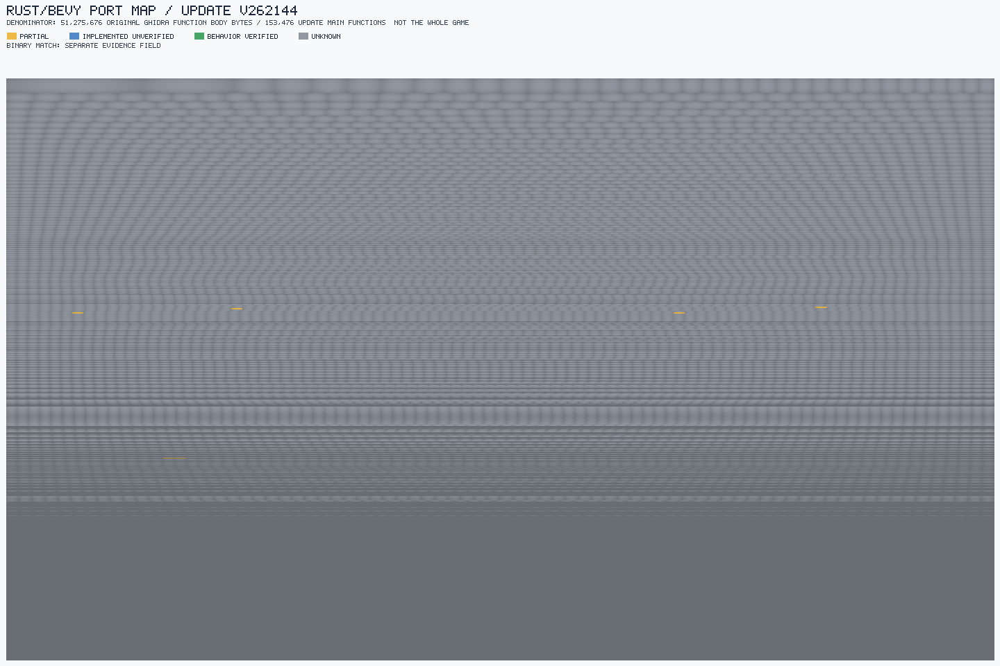
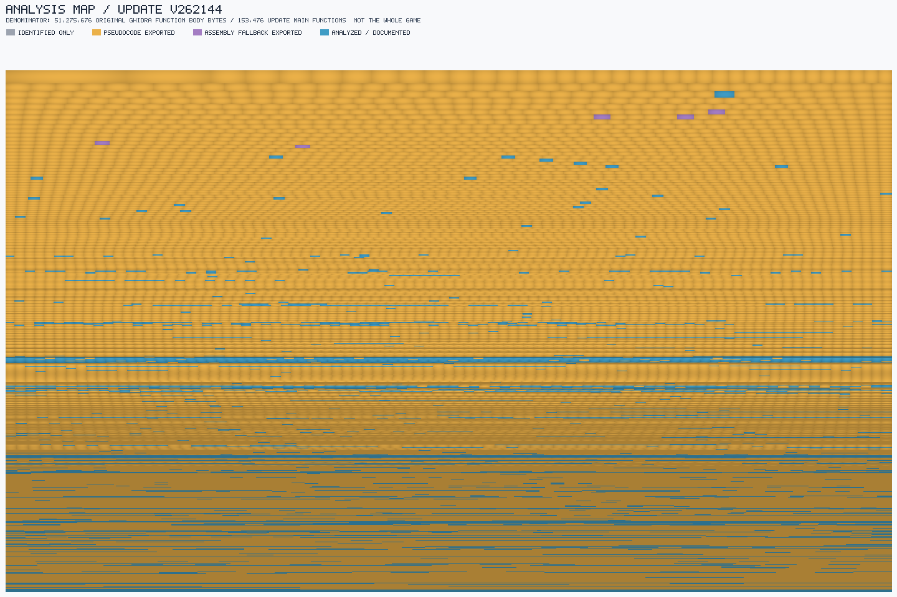

# Pokémon Legends: Arceus — Proyecto de ingeniería inversa y port a Rust/Bevy

[English](README.md) · **Español**

El objetivo de este repositorio es hacer ingeniería inversa de una copia
legítima de *Pokémon Legends: Arceus* (Nintendo Switch) y guiar un port a
Rust/Bevy desde un libro de hojas versionado haciendo uso de **The Spreadsheet Method**.

> **Este repositorio no contiene contenido del juego.** Ni ROMs/NSZ, ni assets
> extraídos, ni código descompilado, ni claves. Incluye el *método*, las
> *herramientas* y el *conocimiento derivado* (hojas). Cada colaborador aporta su
> propia copia del juego y sus `prod.keys`, y regenera los artefactos pesados en
> local — véase [`REPRODUCE.md`](REPRODUCE.md).

## Situación del proyecto

Cifras sobre el `main` del update v262144 (153.476 funciones localizadas). El detalle fase a fase está en la [Tabla de cierre](#tabla-de-cierre). Última actualización: 2026-10-07.

### 📊 Avance por fase

<!-- progress-bars:start -->
```text
 1 Extracción                       ████████████████████    100 %   archivos y miembros enumerados
 2 Inventario de main               ███████████████████░   98,4 %   bytes ejecutables dentro de funciones
 3 Export de pseudocódigo           ████████████████████    100 %   de las 153.476 funciones localizadas
 4 Índice gameDB                    ████████████████████    100 %   de los archivos C exportados
 5 Datos (RomFS)                    ████████████████████    100 %   extraídos y superpuestos
     · interpretación               ░░░░░░░░░░░░░░░░░░░░    3,0 %   14/466 modificados comparados por dentro
 6 Análisis: leídas por analistas   ░░░░░░░░░░░░░░░░░░░░    1,1 %   1.623 de 153.476 funciones
     · clasificadas por el programa ███░░░░░░░░░░░░░░░░░   18,4 %   28.308: funciones diminutas; dice qué hacen, no para qué sirven
     · copiadas de idénticas        ██░░░░░░░░░░░░░░░░░░   11,8 %   18.051: copias exactas de una función auditada
     · centralitas de importación   ░░░░░░░░░░░░░░░░░░░░    0,5 %   801: identificadas con los datos de enlace
 7 Implementación (port)            ░░░░░░░░░░░░░░░░░░░░   <0,1 %   8 de 153.476 con implementación parcial
 8 Verificación de conducta         ░░░░░░░░░░░░░░░░░░░░      0 %   0 de 153.476
 9 Binary matching                  ░░░░░░░░░░░░░░░░░░░░      0 %   0 de 153.476
10 Port jugable                     █████████░░░░░░░░░░░    ~45 %   media de estimaciones cualitativas
```

*Las barras miden lo que está cuantificado en cada fase; el denominador completo de varias fases es desconocido (véase la Tabla de cierre). La fase 2 mide bytes de código cubiertos por funciones, no número de funciones; en la fase 6 solo la primera línea son funciones leídas y entendidas; las otras tres se cuentan aparte.*
<!-- progress-bars:end -->

### ✅ Hecho

- **Material extraído:** base (v0) y update (v262144) disponibles; los cinco ejecutables (`main`, `rtld`, `sdk`, `subsdk0`, `subsdk1`) extraídos y verificados por hash; RomFS extraído y superpuesto. Los módulos auxiliares del update son idénticos byte a byte a los de la base.
- **Datos del juego:** el overlay base + update tiene 19.095 archivos (17.904 sin cambios, 466 modificados, 725 añadidos, 0 eliminados). Interpretados: los scripts Lua de la base (799 de 800), tablas y textos seleccionados.
- **Funciones de `main`:** 153.476 funciones localizadas, todas con pseudocódigo exportado (153.471 en C y 5 en ensamblador) e indexadas en gameDB. Tras corregir seis marcas «no vuelve» erróneas, sus cuerpos cubren el **98,40 %** del código ejecutable (52.255.468 de 53.106.320 bytes). Los 850.852 bytes restantes están clasificados (relleno, tablas, datos y posible código), pero no interpretados ([informe](reports/function-progress/d1-main-gap-closure.md)).
- **Código de terceros separado:** 36.021 funciones (23,47 %) son bibliotecas incluidas en el programa (red, Havok, Wwise, SDK de Nintendo, Lua, Oodle). El código del juego es, como máximo, 117.455 funciones ([informe](reports/function-progress/d2-library-ownership.md)).
- **Hallazgos técnicos:** el hash de nombres del motor es FNV-1a de 64 bits con valor inicial propio (reproduce 450 de 450 ids de flags de eventos); resueltas las 816 llamadas a bibliotecas; aplicados 205.023 punteros de datos que faltaban.
- **Funciones documentadas: 48.783 de 153.476 (31,79 %), en cuatro categorías separadas:** 801 centralitas de importación, 1.623 registros con lectura completa del cuerpo, 18.051 copias de funciones EXACT auditadas independientemente y 28.308 clasificaciones mecánicas deterministas. Son descripciones estáticas de operaciones, no interpretación del propósito en el juego, tipos (N2), verificación en ejecución ni coincidencia binaria. [Última ronda de documentación](reports/function-progress/d4-batch24-documentation-first.md); [cola repetible](reports/function-progress/d4-documentation-queue.md).
- **Funciones idénticas agrupadas:** 109.550 funciones distintas de 153.476; 53.912 están en grupos de copias idénticas.
- **Port:** esqueleto en Rust que carga y ejecuta scripts de evento reales.

### 🔄 En curso

- Leer, por orden de importancia, las funciones del juego que quedan.

### ❌ Falta

- **Entender el código del juego:** solo el 0,87 % lo han leído analistas; el resto de lo documentado son centralitas, copias o funciones diminutas.
- **Corregir los límites mal marcados** de algunas funciones. Cambiaría el total de 153.476 y está pendiente de decisión.
- **Regenerar el pseudocódigo exportado,** que está desfasado respecto a las correcciones.
- **Datos:** 452 de los 466 archivos modificados siguen sin comparación interna satisfactoria, y no se sabe a qué código pertenece cada archivo de datos.
- **Verificación de comportamiento y binary matching:** 0 de 153.476 funciones.
- **Port:** parcial (8 funciones con implementación parcial; visual, guardado y enlaces con el sistema muy incompletos).

## El juego: base + update

El juego se distribuye en dos partes:

- **Base** (`pk1.nsz`, v0) — el título completo: todos los módulos ejecutables
  (`main`, `rtld`, `sdk`, `subsdk0`, `subsdk1`) y casi todos los datos (el RomFS,
  ~2,3 GB).
- **Update** (`pk2.nsz`, v1.1.1 / v262144) — un **parche**, no un programa
  independiente. Trae un `main` nuevo completo y solo los archivos de datos que
  cambia (un delta AesCtrEx/BKTR).

**El update no se ejecuta por sí solo.** Jugar la v1.1.1 requiere la base **y** el
update; el juego en ejecución es el **overlay de los dos**, y el código que corre
es el `main` del update, que reemplaza al de la base. La base es, por tanto,
**obligatoria** — aporta todo lo que el update no trae.

**Objetivo del port:** el juego tal como se ejecuta con el update aplicado (el
overlay base + update) — nunca «el update», que no es un programa. El `main` de
la base (v0) es una compilación anterior del mismo programa y no se porta; se
conserva solo por procedencia.

## Tabla de cierre

Estado fase por fase, desde los volcados brutos del juego hasta un port jugable.
Los porcentajes se cuentan de archivos y funciones reales dentro del
inventario declarado; los de extracción se refieren a los conjuntos enumerados
de miembros/rutas, no a un denominador total del juego sin demostrar.
`Desconocido` indica
que se desconoce el denominador completo de esa fase/módulo, por lo que no se
inventa un porcentaje de avance; usa `No aplica` solo cuando la parte no
corresponda. Los recuentos de archivos disponibles no demuestran la cobertura
completa del módulo. `~` marca estimaciones cualitativas.

| Fase (PLAN.md) | Parte | % hecho | % restante | Nota | Métodos / herramientas |
|---|---|:--:|:--:|---|---|
| 1. Extraer (P0) | Base: ExeFS + RomFS | 100 % | 0 % | | Pipeline de extracción `.tools`; parseo NSO; comprobaciones SHA-256 y hashes de segmentos |
| | Update: `main` + datos | 100 % | 0 % | | Pipeline `.tools`; manifiestos NCZ/ExeFS/RomFS; comprobaciones de hashes |
| | Módulos del update (`rtld`, `sdk`, `subsdk0/1`) | 100 % | 0 % | extraídos + verificados (NSO); idénticos byte a byte a los de la base | Extracción NSO y comparación byte/hash con los módulos base |
| 2. Inventario (P0) | `main` update | Desconocido | Desconocido | Las 153.476 funciones inventariadas coinciden exactamente con el FunctionManager del proyecto Ghidra. En la copia de trabajo, tras corregir seis marcas «no vuelve» erróneas (D1), la unión de cuerpos es 52.255.468 / 53.106.320 bytes (98,40 %); la referencia fix2 original era 51.275.676 (96,55287 %). 850.852 bytes siguen fuera de los cuerpos y están clasificados en el [informe D1](reports/function-progress/d1-main-gap-closure.md). El denominador completo de funciones válidas sigue desconocido ([reconciliación de rangos](reports/function-progress/p0-update-main-ghidra-range-reconciliation.md), [clasificación de gaps](reports/function-progress/p0-update-main-gap-classification.md)) | Reconciliación de rangos de cuerpos en Ghidra, clasificación del estado de listing y corrección de marcas «no vuelve» |
| | `main` base | Desconocido | Desconocido | 68.412 detecciones históricas limitadas; no son denominador completo. Procedencia cualificada (15/15 hashes de segmento NSO); `main` base es solo referencia de procedencia para el port. | Parser directo de metadatos NSO; module ID, SHA-256 y hashes de segmentos |
| | `sdk` / `subsdk0` / `subsdk1` / `rtld` | Desconocido | Desconocido | Uniones de cuerpos existentes / bytes `.text` / gaps: `rtld` 5.220/6.240; gap 1.020/13 rangos; `sdk` 1.167.456/5.822.640; gap 4.655.184/11.529; `subsdk0` 1.746.372/3.445.104; gap 1.698.732/2.268; `subsdk1` 5.016.388/6.298.960; gap 1.282.572/3.210. Solo concierne a las detecciones existentes, no a cobertura funcional completa. Completitud del inventario y denominadores completos de export desconocidos; el índice gameDB del corpus C disponible ya está completado ([reconciliación de rangos](reports/function-progress/p0-auxiliary-range-reconciliation.md)) | Uniones de rangos y clases de gap del listing Ghidra; cotejo de IDs del inventario; completitud no establecida |
| 3. Export de pseudocódigo (prep) | `main` update | 100 % del inventario localizado | 0 % del inventario localizado | Las 153.476 funciones inventariadas tienen salida (153.471 C + 5 ASM); por separado, la unión exacta de cuerpos es 96,55287 % de los bytes ejecutables, con 3,44713 % fuera de los cuerpos existentes. La consulta corregida con `getCodeUnitContaining` clasifica las 13.897 semillas fuera de cuerpos en 77 dentro de instrucciones definidas (308 bytes), 13.820 dentro de datos definidos (13.820 bytes), 0 indefinidas y 0 sin mapear; 91 objetivos / 179 referencias entrantes (CALL 8/11; clase JUMP 64/66, condicionalidad combinada; otro flujo 0/0; no flujo 19/102). El metadato listing/referencias no demuestra semántica, reachability, límites ni existencia de funciones. La consulta anterior con `getCodeUnitAt` confundió direcciones internas de unidades con indefinidas; la división previa de subtipos JUMP queda reemplazada/no confirmada. La interpretación del residual y la validez de funciones candidatas quedan **Diferidas fuera de P0**; no son tareas ni gates de salida de P0 ([auditoría residual](reports/function-progress/p0-update-main-residual-export.md), [rangos](reports/function-progress/p0-update-main-ghidra-range-reconciliation.md), [clasificación de gaps](reports/function-progress/p0-update-main-gap-classification.md), [triage de referencias](reports/function-progress/p0-update-main-gap-flow-triage.md), [evidencia correctiva](reports/function-progress/p0-update-main-gap-flow-triage-correction.md)) | Inventario/export Ghidra fix2; fallback C/ASM; reconciliación directa de rangos, estado de listing y triage de metadatos de referencias |
| | `main` base | 5,8 % | 94,2 % | 3.997 de 68.412 | Pipeline de export de Ghidra; limitado por el inventario base actual |
| | `sdk` / `subsdk0` / `subsdk1` / `rtld` | Desconocido | Desconocido | 20.327 exports C / 7.902.740 bytes sumados de cuerpos; el 50,75 % de 15.572.944 bytes `.text` es una razón medida de tamaño de cuerpos, no cobertura; denominador completo de funciones desconocido ([informe](reports/function-progress/p0-auxiliary-module-export-inventory.md)) | Export C de Ghidra 12.1.2; suma de tamaños de cuerpo; no es porcentaje de cobertura |
| 4. Índice (gameDB) (prep) | `main` update | 100 % | 0 % | Indexados todos los 153.471 archivos C disponibles en staging; 152.634 filas de función parseadas y 837 archivos sin fila parseada. Los 5 fallbacks ASM quedan fuera de este corpus solo C. Es indexación del export disponible, no cobertura semántica ([informe de índice global](reports/function-progress/p0-global-gamedb-index.md)) | Índice SQLite de gameDB; comprobaciones de paridad solo lectura |
| | `main` base | 5,8 % | 94,2 % | Export/índice parcial actual: 3.997 archivos, 3.917 filas de función parseadas y 80 sin fila parseada; el porcentaje sigue acotado a 3.997 / 68.412 funciones inventariadas ([informe de índice global](reports/function-progress/p0-global-gamedb-index.md)) | Índice gameDB limitado por el export parcial de pseudocódigo base |
| | `sdk` / `subsdk0` / `subsdk1` / `rtld` | Desconocido | Desconocido | Indexados todos los archivos C disponibles en staging: 20.327 archivos / 20.116 filas de función parseadas / 211 sin fila parseada (`rtld` 31/31/0; `sdk` 9.063/9.002/61; `subsdk0` 2.959/2.901/58; `subsdk1` 8.274/8.182/92; cada tripleta es archivos/filas/archivos sin fila). Se desconocen los denominadores funcionales completos; por eso el avance del módulo es Desconocido ([informe de índice global](reports/function-progress/p0-global-gamedb-index.md)) | Índice SQLite de gameDB; recuentos del export actual, no cobertura completa del módulo |
| 5. Datos (RomFS) (P0) | Scripts Lua de la base | 99,9 % | 0,1 % | 799 de 800 | Extracción RomFS; parseo Lua y validación por archivo |
| | Overlay efectivo base + update | 100 % | 0 % | **Solo aritmética del overlay:** 19.095 entradas virtuales (17.904 sin cambios / 466 modificadas / 725 añadidas / 0 eliminadas). Comparaciones estructurales: 14/466 modificadas satisfactorias (SARC 10/10; GFLXPACK 4/10); 452/466 siguen sin comparación interna satisfactoria. Mensajes: 376 archivos modificados + 320 añadidos; 189 pares completos, 179 aceptados por completo / 10 parciales; `.dat` 378/378 y `.tbl` 368/378 aceptados. Compilación `.blua`: 96/108 aceptados, 12 rechazados (las 108 cabeceras Lua 5.3; chunks no ejecutados). `.bin` de progreso de eventos: 68/90 aceptados, 22 no soportados; el parser carece de firma mágica. Hashes de añadidos: 33/725 coincidencias exactas en la base, 692/725 sin coincidencia exacta; la ausencia no prueba novedad. **Ownership semántico desconocido para 1.191/1.191 entradas delta.** | Manifiesto verificado por hashes; solo parsers estructurales por formato; comparación agregada de hashes; véanse la [auditoría/addenda del overlay](reports/function-progress/p0-overlay-ownership.md), [tablas de mensajes](reports/function-progress/p0-message-table-overlay-audit.md), [AHTB](reports/function-progress/p0-ahtb-overlay-reinspection.md), [GFLXPACK](reports/function-progress/p0-gfpak-variant-followup.md), [Lua](reports/function-progress/p0-blua-overlay-compile-audit.md), [tablas de eventos](reports/function-progress/p0-event-table-overlay-audit.md) y [auditoría interna local](reports/function-progress/p0-overlay-local-internal-audit.md) |
| | Paquetes SARC | Desconocido | Desconocido | Índice solo-base: 257 archivos SARC y 3.416 miembros anidados; el denominador efectivo base+update y su semántica son desconocidos. Los miembros anidados no se suman a las 19.095 rutas externas. | Parser/indexador SARC; denominador total no establecido |
| | Textos / referencias | Desconocido | Desconocido | 13.370 + 29.162, sin total | Scanners de extracción/referencias; denominador total no establecido |
| | Tablas de dominio | Desconocido | Desconocido | 12 hojas, sin total | Ingesta TSV/hojas y preflight `sheetty` |
| | Datos de la base | 100 % de rutas externas enumeradas | 0 % de rutas externas enumeradas | 18.370 rutas externas de la base; no es un inventario semántico completo ni incluye hijos de archivos anidados. | Extracción RomFS; índice completo de datos base pendiente |
| 6. Análisis (P2–P7) | Código del juego | ~31,79 % (1,06 % leído) | ~68,21 % | 48.783/153.476 documentadas: 801 centralitas de importación, 1.623 leídas individualmente, 18.051 copias EXACT auditadas y 28.308 clasificaciones mecánicas. 104.693 funciones localizadas siguen sin marcador. Prioridad: documentar las operaciones observadas de todas las funciones; interpretar su propósito y completar N2 viene después. El inventario localizado no es el universo completo de funciones válidas. | [Última ronda D4](reports/function-progress/d4-batch24-documentation-first.md); [cola de documentación](reports/function-progress/d4-documentation-queue.md); [perfil fix2 actual](reports/function-progress/p0-fix2-treemap-profile.md) |
| 7. Implementación (P3–P7) | Port en Rust | ~0,0052 % de parciales | Desconocido | 8/153.476 funciones fix2 localizadas tienen implementación parcial; parcial no significa completa. El denominador es el inventario localizado, no el universo completo de funciones válidas. | Implementación Rust/Bevy y ledger de progreso; [perfil y treemap fix2 actuales](reports/function-progress/p0-fix2-treemap-profile.md) |
| 8. Verificación de comportamiento (P3–P7, P9) | Funciones fix2 localizadas | 0 % en fix2 | Desconocido | 0/153.476 funciones fix2 localizadas verificadas; el universo completo más allá de la cobertura de cuerpos es desconocido. | No hay verificación conductual independiente completada; [perfil y treemap fix2 actuales](reports/function-progress/p0-fix2-treemap-profile.md) |
| 9. Binary matching (P8–P9) | Funciones fix2 localizadas | 0 % en fix2 | Desconocido | 0/153.476 funciones fix2 localizadas cotejadas; el universo completo más allá de la cobertura de cuerpos es desconocido. | No hay ejecución reproducible de binary matching completada; [perfil y treemap fix2 actuales](reports/function-progress/p0-fix2-treemap-profile.md) |
| 10. Port jugable (P6–P7 → P9) | Parsers de contenedores (SARC, GFLXPACK, AHTB, BNTX, VFXB) | ~90 % | ~10 % | pendientes ASTC y formatos BNTX desconocidos | Parsers Rust, fixtures y tests focalizados de parsing |
| | Capa Lua 5.3 | 100 % | 0 % | ejecuta scripts de evento reales | Host Lua 5.3 en Rust y fixtures de scripts de evento |
| | Enlaces al sistema (*host bindings*) | ~10 % | ~90 % | 2 reales, el resto stubs | Bindings Rust/Bevy, trazas de eventos y stubs |
| | Sistema de guardado | ~30 % | ~70 % | sembrado con 450 flags de evento | Modelo de estado Rust y fixtures de flags de evento |
| | Subsistema visual | ~40 % | ~60 % | solo a nivel de assets; sin render completo | Decodificador BNTX, ruta Bevy imagen/sprite y tests headless |
| | Modelos/animaciones `tr*`, ASTC, Havok→avian3d | 0 % | 100 % | pendiente | No completado; no hay evidencia de implementación |

Esta tabla inventaría *lo que existe* en cada tramo de
[`odd/PLAN.md`](odd/PLAN.md).

Las fases 1–5 describen *tener* el código y los datos.
Las fases 6–9 describen *comprenderlo y portarlo*. 

## Qué hay aquí

| Ruta | Qué es |
|---|---|
| `sheets/` | **El libro de hojas** (la fuente de verdad): doctrina, esquema, plan/impl, decisiones, hojas de dominio y las hojas de evidencia de RE. |
| `crates/sheetty` | Parser canónico de TSV, preflight L0–L3, emisor por hoja (registro PHF, índice denso, módulos Rust generados). |
| `crates/sheetty-cli` | `sheetty check <sheets-dir>` — la CLI de preflight. |
| `crates/pla` | El crate del port: parsers de contenedores/assets, host de scripts Lua 5.3, sistema de guardado, esqueleto ECS/visual guiado por hojas. |
| `gamedb/` | **Submódulo Git** — [smileybaal/gamedb](https://github.com/smileybaal/gamedb) (MIT), el indexador de código descompilado en SQLite. |
| `.tools/` | El pipeline de extracción (Python) y los scripts de export de Ghidra. |
| `odd/` | Documentos de tareas de *Organic Driven Development* (bitácora por funcionalidad y el plan de ejecución). |
| `THE-SPREADSHEET-METHOD.json` | El método normativo (documento de diseño maestro) que implementa este espacio. |

## Inicio rápido

```bash
# 0. Clonar con el submódulo (o: git submodule update --init)
git clone --recurse-submodules <repo-url> && cd <repo>

# 1. Libro de hojas: preflight + módulos generados
cargo run -p sheetty-cli -- check sheets     # 0 errores esperados
cargo build -p pla                           # build.rs ejecuta el preflight + emisor
cargo build --manifest-path gamedb/Cargo.toml --release   # el indexador

# 2. Tests (los fixtures del juego son opcionales: los que faltan se saltan)
cargo test
```

### Ejecutar los tests con fixtures

Los tests de parsers/eventos usan archivos reales del juego como *fixtures*.
Apunta `PLA_FIXTURES` a tu propia extracción (véase `REPRODUCE.md` para la lista
de fixtures), o cópialos en `crates/pla/tests/fixtures/`:

```bash
PLA_FIXTURES=/ruta/a/tu/extraccion cargo test
```

Sin fixtures el repositorio compila igual y todos los tests pasan (los basados en
fixtures imprimen `[skip]` y terminan).

## Progreso por función





[Tabla actual de evidencia por función fix2](reports/function-progress/update-v262144-fix2/function-progress.tsv) ·
[Mapa de análisis fix2 actual](reports/function-progress/update-v262144-fix2/analysis.png) ·
[Informe del perfil fix2 actual](reports/function-progress/p0-fix2-treemap-profile.md) ·
[Última auditoría de evidencia](reports/function-progress/update-v262144-evidence-audit.md)

El área y los porcentajes de los mapas están ponderados por **bytes originales
del cuerpo de las funciones nativas** y solo cubren el **inventario localizado
fix2 del NSO `main` del update v262144**, no la completitud de todo el juego, la
legibilidad del pseudocódigo ni las líneas de Rust. El universo de funciones
válidas más allá de la cobertura de cuerpos existentes sigue siendo desconocido.
El perfil `update-v262144` es una vista histórica limitada a 68.330 funciones.
Las implementaciones parciales son ports condicionales; la verificación de
comportamiento de función completa y el *binary matching* siguen sin conocerse.

## Legal

Esto es investigación de interoperabilidad sobre un juego que los colaboradores
poseen. **No** se debe commitear ni redistribuir contenido del juego, assets
extraídos, salida descompilada ni claves de consola. La salida descompilada es
evidencia para escribir filas de hojas — nunca código fuente. Véase
[`CONTRIBUTING.md`](CONTRIBUTING.md).
