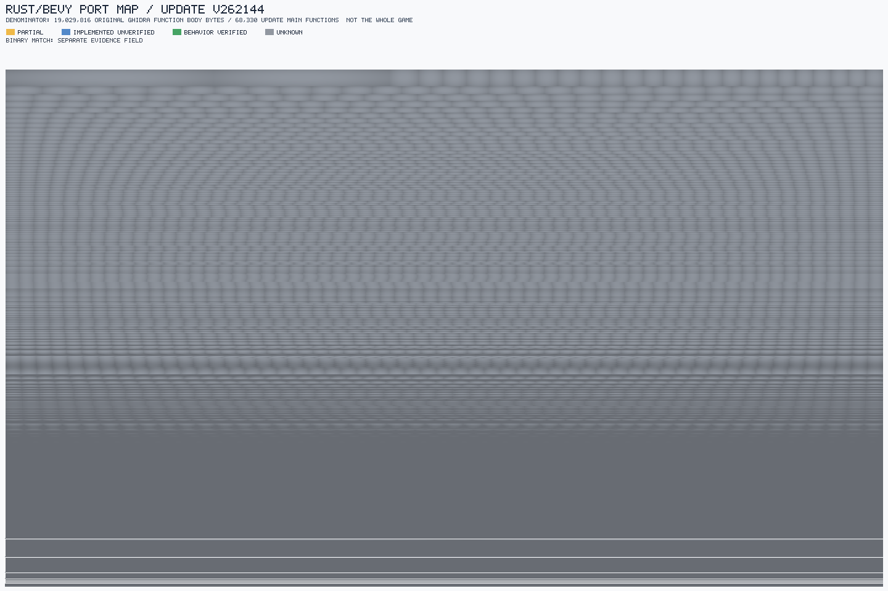
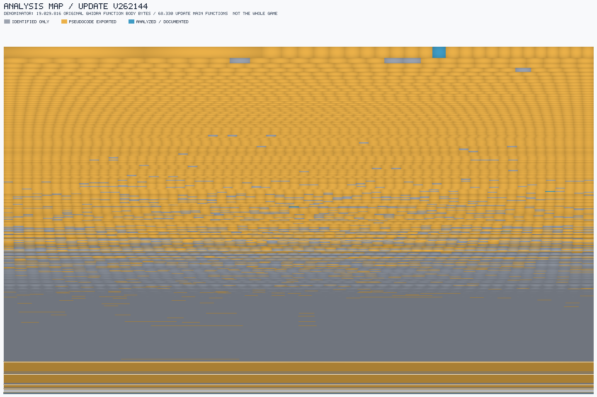

# Pokémon Legends: Arceus — reverse-engineering workspace & Rust/Bevy port

**English** · [Español](README.es.md)

A **The Spreadsheet Method** workspace for reverse-engineering a legally owned
copy of *Pokémon Legends: Arceus* (Nintendo Switch) and driving a Rust/Bevy port
from a versioned sheet book.

> **This repository contains no game content.** No ROMs/NSZ, no extracted
> assets, no decompiled code, no keys. It ships the *method*, the *tooling* and
> the *derived knowledge* (sheets). Every collaborator supplies their own copy of
> the game and their own `prod.keys`, and regenerates the heavy artifacts
> locally — see [`REPRODUCE.md`](REPRODUCE.md).

## Where the project stands

| | |
|---|---|
| ✅ **Done** | Both dumps (base + update) acquired; all executable code and RomFS data extracted; the update `main` pseudocode exported (**96.55 %** of its bytes) and searchable in gameDB; RomFS data largely parsed (Lua 799/800, tables, texts); a Rust port scaffold that loads and runs real event scripts. |
| 🟡 **In progress** | Pseudocode is *not* understanding: analysis, port and verification of the game code are ~**0.03 %** done. The base `main` export is partial (**5.8 %**). |
| ❌ **Missing** | NCA-header decode; file-level ownership of the changed/added data; runtime dependency resolution; the last **3.45 %** of the update `main` (needs emulator tracing); behaviour verification and binary matching are **0 %**. |

The detailed, phase-by-phase breakdown is the [Completion plan](#completion-plan)
below — the single status source. The canonical execution route and its evidence
gates live in [`odd/PLAN.md`](odd/PLAN.md).

## The game: base + update

The game ships in two parts:

- **Base** (`pk1.nsz`, v0) — the complete title: every executable module
  (`main`, `rtld`, `sdk`, `subsdk0`, `subsdk1`) and almost all data (the RomFS,
  ~2.3 GB).
- **Update** (`pk2.nsz`, v1.1.1 / v262144) — a **patch**, not a standalone
  program. It carries a complete new `main` plus only the data files it changes
  (an AesCtrEx/BKTR delta).

**The update does not run on its own.** Playing v1.1.1 needs the base **and** the
update; the running game is the **overlay of the two**, and the program code that
executes is the update's `main`, which replaces the base's. The base is therefore
**mandatory** — it supplies everything the update does not ship.

**Port target:** the game as it runs with the update applied (the base + update
overlay) — never "the update", which is not a program. The base's own `main` (v0)
is an older build of the same program and is not ported; it is recorded for
provenance only.

## Completion plan

Phase-by-phase status from the raw game dumps to a playable port. Percentages are
counted from real files and functions; `—` means there is no known denominator
(not measured, so no percentage is invented) and `~` marks qualitative
estimates.

| Phase (PLAN.md) | Part | % done | % left | Note |
|---|---|:--:|:--:|---|
| 1. Extract (P0) | Base: ExeFS + RomFS | 100 % | 0 % | |
| | Update: `main` + data | 100 % | 0 % | |
| | Update modules (`rtld`, `sdk`, `subsdk0/1`) | 100 % | 0 % | extracted + NSO-verified; byte-identical to the base's |
| 2. Inventory (P0) | `main` update | 100 % | 0 % | 153,476 functions |
| | `main` base | 100 % | 0 % | 68,412 functions; provenance/pin unresolved (P0) |
| | `sdk` / `subsdk0` / `subsdk1` / `rtld` | 0 % | 100 % | |
| 3. Pseudocode export (prep) | `main` update | 96.55 % | 3.45 % | 100 % of its inventory; 96.55 % of its executable bytes |
| | `main` base | 5.8 % | 94.2 % | 3,997 of 68,412 |
| | `sdk` / `subsdk0` / `subsdk1` / `rtld` | 0 % | 100 % | |
| 4. Index (gameDB) (prep) | `main` update | ~100 % | ~0 % | 153,471 files; the 5 asm fallbacks are outside the index |
| | `main` base | 5.8 % | 94.2 % | 3,997 (bounded by export) |
| | `sdk` / `subsdk0` / `subsdk1` / `rtld` | 0 % | 100 % | |
| 5. Data (RomFS) (P0) | Lua scripts | 99.9 % | 0.1 % | 799 of 800 |
| | Update files | 100 % | 0 % | 19,095 extracted (update only) |
| | SARC packages | — | — | 264 indexed, no total |
| | Strings / references | — | — | 13,370 + 29,162, no total |
| | Domain tables | — | — | 12 sheets, no total |
| | Base data | — | — | extracted, no clear index |
| 6. Analysis (P2–P7) | Game code | 0.03 % | 99.97 % | 22 of 68,330 |
| 7. Implementation (P3–P7) | Rust port | 0.01 % | 99.99 % | 8 partial |
| 8. Behaviour verification (P3–P7, P9) | — | 0 % | 100 % | 0 functions |
| 9. Binary matching (P8–P9) | — | 0 % | 100 % | 0 functions |
| 10. Playable port (P6–P7 → P9) | Container parsers (SARC, GFLXPACK, AHTB, BNTX, VFXB) | ~90 % | ~10 % | ASTC and unknown BNTX formats pending |
| | Lua 5.3 layer | 100 % | 0 % | runs real event scripts |
| | Host bindings | ~10 % | ~90 % | 2 real, rest stubs |
| | Save system | ~30 % | ~70 % | seeded from 450 event flags |
| | Visual subsystem | ~40 % | ~60 % | asset-level only; no full render |
| | `tr*` models/animations, ASTC, Havok→avian3d | 0 % | 100 % | pending |

This table inventories *what exists* in each stretch of
[`odd/PLAN.md`](odd/PLAN.md); that plan is the canonical execution route and
fixes the order and evidence gates. The parenthesised labels carry the matching
PLAN.md phase: the preparation phases (1–5) belong to **P0**, and phases 6–10
belong to **P2–P9**, a dependency chain (`P3 → P4 → P5 → P6 → P7`) in which
parallelism exists only *inside* a phase. The port target is the game as it runs
with the update applied (the base + update overlay), never the update alone.

Phases 1–5 describe *having* the code and data; phases 6–9 describe
*understanding and porting* it and hold ~99.97 % of the remaining work. The
68,330 denominator in phases 6–7 is the earlier capped inventory; the fix2
export is a larger, more complete inventory of the same update `main`.

The update's auxiliary modules (`rtld`, `sdk`, `subsdk0/1`) are extracted and
NSO-verified, and are byte-identical to the base's; what remains for them is a
complete import/relocation inventory and pseudocode export/index, not extraction.

## What is here

| Path | What it is |
|---|---|
| `sheets/` | **The sheet book** (the source of truth): doctrine, schema, plan/impl, decisions, domain sheets and the RE evidence sheets. |
| `crates/sheetty` | Canonical TSV parser, L0–L3 preflight, per-sheet emitter (PHF registry, dense index, generated Rust modules). |
| `crates/sheetty-cli` | `sheetty check <sheets-dir>` — the preflight CLI. |
| `crates/pla` | The port crate: container/asset parsers, Lua 5.3 script host, save system, sheet-driven ECS/visual scaffold. |
| `gamedb/` | **Git submodule** — [smileybaal/gamedb](https://github.com/smileybaal/gamedb) (MIT), the decompiled-source indexer (SQLite). |
| `.tools/` | The extraction pipeline (Python) and the Ghidra export scripts. |
| `odd/` | Organic Driven Development task documents (per-feature work log and the execution plan). |
| `THE-SPREADSHEET-METHOD.json` | The normative method (master design document) this workspace implements. |

## Quickstart

```bash
# 0. Clone with the submodule (or: git submodule update --init)
git clone --recurse-submodules <repo-url> && cd <repo>

# 1. Sheet book: preflight + generated modules
cargo run -p sheetty-cli -- check sheets     # 0 errors expected
cargo build -p pla                           # build.rs runs the preflight + emitter
cargo build --manifest-path gamedb/Cargo.toml --release   # the indexer

# 2. Tests (game fixtures are optional: missing ones skip)
cargo test
```

### Running the fixture-based tests

The parser/event tests use real game files as fixtures. Point `PLA_FIXTURES` at
your own extraction (see `REPRODUCE.md` for the fixture list), or copy them into
`crates/pla/tests/fixtures/`:

```bash
PLA_FIXTURES=/path/to/your/extraction cargo test
```

Without fixtures the repository still compiles and every test passes (the
fixture-based ones print `[skip]` and return).

## Function-level progress





[Interactive maps and per-function evidence](reports/function-progress/update-v262144/index.html) ·
[Analysis map](reports/function-progress/update-v262144/analysis.png) ·
[Latest evidence audit](reports/function-progress/update-v262144-evidence-audit.md)

Map area and percentages are weighted by **original native function-body bytes**
for update v262144 **main NSO only**, not whole-game completion, pseudocode
readability or Rust line count. Partial implementations are conditional ports;
whole-function behavioral verification and binary matching remain unknown.

## Legal

This is interoperability research on a game the collaborators own. Do **not**
commit or redistribute game content, extracted assets, decompiled output or
console keys. Decompiled output is evidence for writing sheet rows — never
source. See [`CONTRIBUTING.md`](CONTRIBUTING.md).
